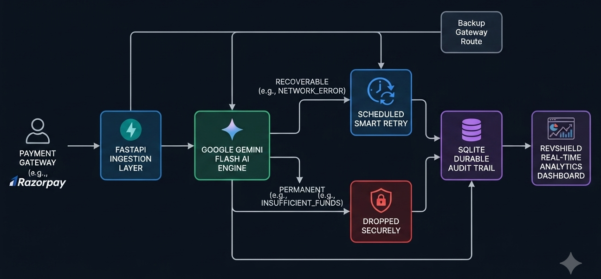

# RevShield AI 🛡️

### Autonomous Payment Failure Recovery & Security Gateway

**RevShield AI** is an intelligent, event-driven payment recovery and risk-management microservice. It uses **Google Gemini Flash** to semantically analyze payment failure webhooks in real-time, automating smart-retries for transient network drops while enforcing strict fail-closed security guardrails for permanent user-side failures.

---

## 🚀 Key Features

* **🧠 AI Semantic Error Analysis:** Leverages Gemini Flash to interpret cryptic or unstructured bank error codes and descriptions contextually rather than relying on brittle static string matching.
* **⚡ Autonomous Routing & Guardrails:** Automatically classifies failures into `RECOVERABLE` (triggering smart retries or backup gateway routing) or `PERMANENT` (instantly blocking invalid transactions).
* **🛡️ Fail-Closed Security Fallback:** In the event of an API rate limit (`429`) or network outage, the system defaults to a secure block (`DROPPED_SECURELY`) to eliminate financial risk.
* **📊 Real-Time Operational Dashboard:** Built-in server-rendered Tailwind CSS dashboard tracking transaction volumes, recovery success rates, and live audit trails.
* **🗄️ Durable SQLite Audit Trail:** Persists comprehensive failure logs, AI rationales, and timestamps for compliance and risk analytics.
* **🔒 PCI-DSS Compliance & Data Minimization:** Zero storage of sensitive Personally Identifiable Information (PII) or raw card credentials (PAN/CVV).

---

## 🏗️ System Architecture & Workflow

### **Architecture Overview**

RevShield AI is built as a modular microservice separating concerns into distinct layers:

1. **Ingestion Layer (FastAPI):** Exposes asynchronous REST endpoints (`/webhook/failure`) to catch payment gateway failure events.
2. **AI Cognitive Layer (Google Gemini Flash):** Semantically evaluates unstructured error logs.
3. **Guardrail Enforcement Layer:** Deterministic Python conditional logic that wraps the AI's output, ensuring a fail-closed secure stance if anomalies occur.
4. **Persistence Layer (SQLite):** Maintains a durable audit log (`revshield.db`) for operational tracking.
5. **Visualization Layer (Tailwind Dashboard):** Renders a real-time risk operations UI at the root route (`/`).

### **Data Lifecycle Workflow**



## 🛠️ Tech Stack

* **Backend Framework:** FastAPI (Python)
* **Server:** Uvicorn (ASGI)
* **AI Model:** Google Gemini Flash (`google-genai` SDK)
* **Environment Management:** `python-dotenv`
* **Database:** SQLite (Relational Audit Trail)
* **Validation & Security:** Pydantic
* **Frontend UI:** Tailwind CSS (Server-rendered HTML Response)

---

## ⚙️ Installation & Quickstart

### **1. Clone the Repository**

```bash
git clone https://github.com/your-username/revshield-ai.git
cd revshield-ai
```

### **2. Install Dependencies**

Create and install requirements using pip:

```bash
pip install fastapi uvicorn google-genai pydantic python-dotenv requests
```

### **3. Configure Environment Variables**

Create a `.env` file in the root directory of your project and add your Gemini API key:

```env
GEMINI_API_KEY=your_actual_gemini_api_key_here
```

### **4. Run the Application**

Start the FastAPI server using Uvicorn with auto-reload:

```bash
python -m uvicorn main:app --reload
```

### **5. Access the Dashboard**

Open your browser and navigate to:
👉 **`http://127.0.0.1:8000/`**

---

## 🔌 API Endpoints Reference

* **`GET /`** — Renders the live Tailwind CSS analytics and risk operations dashboard.
* **`POST /webhook/failure`** — Ingests incoming payment failure payloads, triggers Gemini AI analysis, enforces security guardrails, and commits entries to the database.
* **`GET /audit-trail`** — Returns the last 20 transaction failure audit logs in structured JSON format.

---

## 🛡️ Security & Compliance Principles

* **Data Minimization:** Only non-sensitive operational telemetry (`payment_id`, `amount`, `error_code`, `error_description`) is persisted. No raw card data (PAN) or CVVs are ever handled or logged.
* **Fail-Closed Architecture:** Network disruptions or quota constraints (`429 Too Many Requests`) on the AI engine never result in unverified approvals; the system automatically defaults to secure blocking (`DROPPED_SECURELY`).
